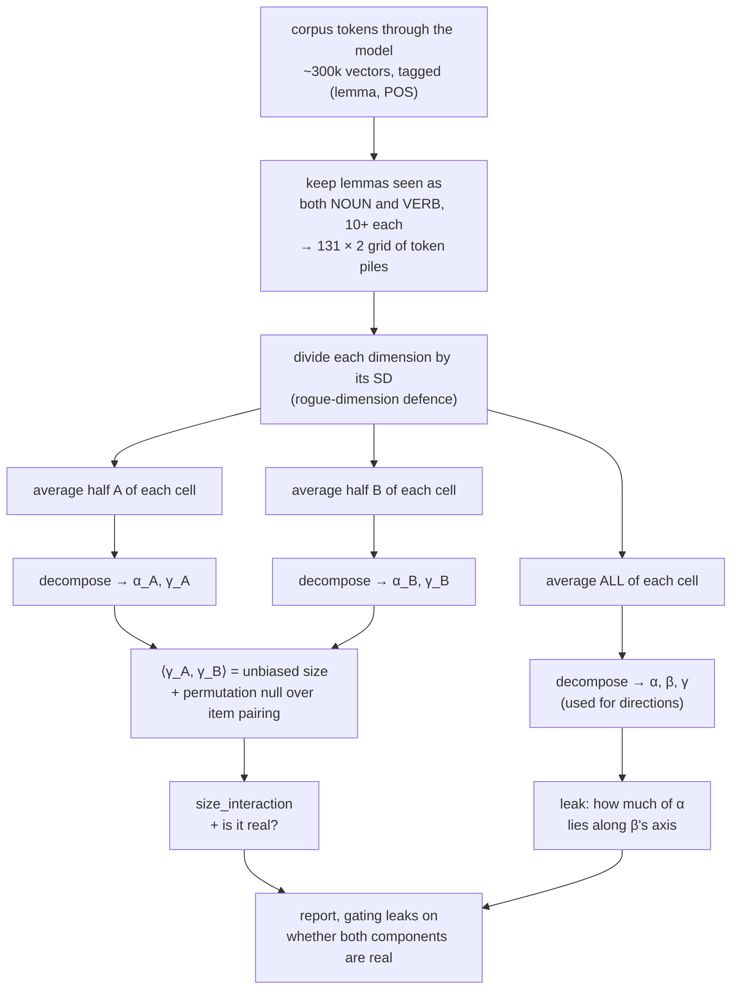

# What the Separability Measure Actually Does

Reference for `scripts/lib/unified_separability.py`.

**Part I** is the pipeline in plain language with a worked example. **Part II** is the one real
problem and how we solve it. **Part III** is the toy. **Part IV** is the formal math, for when you
need to write it up or check an implementation detail.

`NOTES.md` has the history of why we rejected the alternatives. `SEPARABILITY_FINDINGS.md` has the
results. `METHOD.md` describes an **earlier, superseded** measure; where the two disagree, this
document is current.

---

# Part I. The pipeline

## The question, operationally

Take a word that is used as both a noun and a verb, like *run*. The model has some representation
of *run*-the-noun and some representation of *run*-the-verb. We want to know whether those two
representations differ in a way that is **shared with every other word** (a reusable "noun vs verb"
shift) or in a way that is **specific to *run*** (a private, word-by-word difference).

If it's entirely the first, the model has abstracted a category. If it's entirely the second, the
model has memorised each word's uses separately. The answer turns out to be "both," and the measure
quantifies the mix.

## Step 1. Collect representations

Run the corpus through the model. For every token occurrence, at every layer, save the hidden state.
Also record what lemma it is and what POS it is.

You now have a pile of maybe 300,000 vectors in $\mathbb{R}^{2048}$, each tagged
`(lemma, POS)`.

## Step 2. Choose a grid

Decide what counts as an **item** and what counts as a **class**. For the POS analysis: item =
lemma, class $\in$ {NOUN, VERB}.

Keep only lemmas that appear as **both** a noun and a verb, at least 10 times each. That's the
identifiability requirement, and it's what leaves us with 131 lemmas rather than thousands. You now
have a 131 $\times$ 2 table, where each cell holds a bunch of token vectors.

```
              NOUN                    VERB
  run     [ ~800 vectors ]      [ ~600 vectors ]
  hit     [ ~200 vectors ]      [ ~900 vectors ]
  ...
```

## Step 3. Standardise (divide by SD, do NOT subtract the mean)

For each of the 2048 dimensions, compute its standard deviation across all tokens, and divide that
coordinate by it.

$$
\tilde{x}_j = x_j / \sigma_j
$$

**Why:** transformer hidden states have a handful of "rogue" dimensions whose variance is 100 to
1000 times everything else's. Left alone, those few axes dominate every subsequent SVD and you end
up measuring them instead of the linguistics.

**Why no mean subtraction here:** the decomposition in step 5 subtracts a mean anyway, and it
subtracts the *right* one (the average over the grid cells, giving each word equal weight) rather
than the token-frequency-weighted average. Centering here would be harmless but redundant.

## Step 4. Average each cell down to one vector

Replace each cell's pile of vectors with their mean.

$$
M[i,c] = \text{average representation of lemma } i \text{ used as } c
$$

You now have a 131 $\times$ 2 grid where **every cell is a single vector**. Call it $M$. Everything
about individual sentences is gone; from here on we are analysing a small table of averages.

This is the object the rest of the method operates on. If you lose the thread later, come back
here: it's a table with one row per word, one column per category, and a vector in every cell.

## Step 5. Split the table into four pieces

This is the step you already have. It's row-and-column averaging, and it is exact arithmetic, not a
model fit:

| piece | how you get it | what it means |
|:--|:--|:--|
| $\mu$ | average of the whole table | the baseline |
| $\alpha_i$ | row $i$'s average, minus $\mu$ | what *run* is, regardless of POS |
| $\beta_c$ | column $c$'s average, minus $\mu$ | what NOUN is, regardless of word |
| $\gamma_{ic}$ | whatever is left over in cell $(i,c)$ | what *run*-as-NOUN is **beyond** "run + noun" |

$$
M[i,c] = \mu + \alpha_i + \beta_c + \gamma_{ic}
$$

That equation holds exactly, because $\gamma$ is *defined* as the leftover. Nothing is being
estimated or fit. Keep hold of that: $\gamma$ is a residual, and that fact causes the one real
problem in Part II.

### A worked example

Real cells are 2048-dimensional vectors, but the arithmetic runs coordinate by coordinate, so watch
it on a single coordinate with three words:

```
            NOUN   VERB  |  row avg      α
   dog       11      3   |     7        +2
   run        2      6   |     4        −1
   hit        5      3   |     4        −1
  ------------------------------------------
   col avg    6      4   |     5  = μ
   β         +1     −1
```

Now read off the leftovers:

$$
\gamma_{\text{dog,NOUN}} = 11 - \underbrace{5}_{\mu} - \underbrace{2}_{\alpha} - \underbrace{1}_{\beta} = +3
$$

The full $\gamma$ table:

```
            NOUN   VERB
   dog       +3     −3
   run       −3     +3
   hit        0      0
```

Read that out loud, because it *is* the finding in miniature:

- **$\alpha$** says *dog* generally sits higher than *run* and *hit*. That's word identity.
- **$\beta$** says nouns generally sit higher than verbs. That's the reusable category direction,
  the "abstraction."
- **$\gamma$** says *dog* swings much harder between its noun and verb uses than the average word
  does, *run* swings the opposite way, and *hit* doesn't swing at all beyond the general
  noun-verb shift.

$\gamma$ is exactly the thing that is neither "a fact about *dog*" nor "a fact about nouns." It is
the word-specific part of the category effect. Note that every row of $\gamma$ sums to zero and
every column does too; that falls out of the construction and is not an extra assumption.

## Step 6. Ask the two questions

**Question 1: how big is each piece?** Square everything and add it up.

$$
s_{\text{item}} = C\sum_i\lVert\alpha_i\rVert^2, \qquad
s_{\text{class}} = I\sum_c\lVert\beta_c\rVert^2, \qquad
s_{\text{int}} = \sum_{i,c}\lVert\gamma_{ic}\rVert^2
$$

(The $C$ and $I$ multipliers are there because $\alpha_i$ is shared across $C$ cells and $\beta_c$
across $I$ cells; they make the three numbers comparable.) In the example: $s_{\text{item}} =
2(4{+}1{+}1) = 12$, $s_{\text{class}} = 3(1{+}1) = 6$, $s_{\text{int}} = 36$. Total 54, so
$\texttt{size}_\gamma = 36/54 = 0.67$. That toy grid is interaction-dominated.

This is `size_interaction`. It answers: *how much of the structure is irreducibly joint?*

**Question 2: do the pieces point in the same directions?** Size and direction are separate
questions. $\alpha$ is a cloud of 131 vectors; $\beta$ spans a single direction (with two levels,
$\beta_{\text{NOUN}} = -\beta_{\text{VERB}}$). Ask what fraction of $\alpha$'s energy lies along
$\beta$'s direction:

$$
\texttt{leak}_{i\to c} = \frac{\text{energy of }\alpha\text{ inside }\beta\text{'s subspace}}{\text{total energy of }\alpha}
$$

Near zero means word identity and category live on separate axes: project out "noun" and the word
information survives untouched. That is what "the marginals separate cleanly" means.

**Those two numbers are the measure.** Everything else in this document exists to make sure
`size_interaction` isn't lying to you.

---

# Part II. The one real problem, and the fix

## The problem: $\gamma$ is a leftover, and leftovers collect garbage

Each cell of the grid is an average over a finite number of noisy tokens, so $M[i,c]$ is not exact.
That error has to land somewhere in the four-way split, and it lands disproportionately in
$\gamma$, because $\gamma$ is the residual: whatever $\mu$, $\alpha$, and $\beta$ don't absorb.

So **even with no real interaction at all, $\gamma$ comes out nonzero.** Its size is a sum of
squares, which cannot be negative, so noise can only push it up, never down. An earlier version of
this analysis reported "67% interaction" on synthetic data built with *zero* interaction. The
measure was reporting its own noise floor.

## The failed fix: shuffle the labels

The obvious repair is a permutation test: shuffle the POS labels, recompute, and see whether
$\gamma$ shrinks. It does not work, and this is worth understanding because it is the trap.

Shuffling destroys *structure*. But $\lVert\gamma\rVert^2$ is a *magnitude*, and rearranging numbers
does not shrink a sum of squares. The shuffled version carries the same noise floor as the real
one, so both come out large and the test has no power to tell real interaction from junk of the same
size. Permutation tests work on structure statistics. This is not one.

## The fix that works: measure everything twice

Split each cell's tokens into two disjoint halves. Average each half separately. Now you have **two
independent versions of the entire grid**, $M_A$ and $M_B$, and you run the whole decomposition
twice, getting $\gamma_A$ and $\gamma_B$.

Then ask: **do the two halves agree?**

- If $\gamma$ is real, both halves are seeing the same thing, so $\gamma_A$ and $\gamma_B$ point in
  the same direction. Their dot product is positive.
- If $\gamma$ is noise, the two halves have *independent* noise, so they point in unrelated
  directions. Their dot product averages to zero.

So instead of reporting $\lVert\gamma\rVert^2$, we report $\langle\gamma_A, \gamma_B\rangle$.

This one substitution fixes everything:

1. It is **unbiased**. Its expected value is the true $\lVert\gamma\rVert^2$ with no noise floor
   added, at any noise level. Noise makes it wobblier, not bigger.
2. It **can be negative**, so "is it greater than zero?" is a real question with a real answer,
   unlike a sum of squares, which is always positive.
3. It is now a **statistic about agreement between two things**, which is exactly what a
   permutation test can handle.

(For what it's worth, this is the same device as the cross-validated distance estimators used in
neuroimaging RSA, where cross-validating across independent runs removes the positive bias of a
squared distance. Walther et al. 2016, *NeuroImage*.)

## Now the permutation test actually means something

Shuffle **which item in half B gets matched to which item in half A**, then recompute the dot
product. That preserves every magnitude while destroying the item-by-item pairing. If the real
value beats 95% of the shuffled values, the agreement between halves was genuinely item-specific
and not a generic effect.

## And one last guard: don't ask for the direction of something that isn't there

`leak` asks "which way does $\alpha$ point relative to $\beta$?" That question is meaningless if
$\beta$ is essentially zero, because then you're measuring the direction of noise. (Concretely: on
additive toy data with no interaction, the interaction leak came out at a confident-looking 0.7,
which was pure garbage.)

So each component gets a flag: it's "real" if it passes the permutation test **and** is at least 2%
of the total. A leak is reported only when both components it relates are real; otherwise it comes
back blank. That single rule handles both extremes automatically: purely additive data has no
$\gamma$ to orient, purely interactive data has no marginals to orient.

**This is why cells are blank in the CSVs.** `std_leak_item_into_class` is empty at layers 0 through
2 for every model, because `size_class` there is under 2%, so there is no category axis solid enough
to measure a leak into.

## The whole pipeline



---

# Part III. The toy, and why it looks so different

The toy is **not** a second finding. It exists to answer "how do we know the measure works?", which
is the first thing a reviewer asks about a new measure. You build synthetic data where you already
know the true answer, and check that the measure recovers it.

`build_lowrank_frac` generates a small artificial language with a dial, `int_frac` $= f$:

- $f = 0$: word behaviour is exactly "word effect + category effect." **No interaction exists.**
- $f = 1$: word behaviour is *purely* the word-by-category conjunction. **Only interaction exists.**
- in between: a controlled mixture, with total signal strength held constant so only the
  composition changes.

Train a model on that data, measure it, and check that `size_interaction` tracks $f$. That is the
whole purpose. It is also how the 2% floor was calibrated: we know what the answer should be at
$f = 0$.

The model is deliberately a **free per-lexeme embedding**: every (word, category) pair gets its own
independent vector, with no parameter sharing at all. That guarantees a perfectly separable solution
*exists* and is reachable, so if the trained model entangles anyway, that entanglement was learned
rather than forced by the architecture.

## The one wrinkle

In the toy there is exactly **one vector per cell**, not hundreds of tokens. So there is nothing to
split in half, and the Part II fix doesn't directly apply.

Instead we get our two independent measurements by **training the model twice from different random
starting points**. Same data, same task, different initialisation. The noise we're cancelling is
different in kind (it's the arbitrary junk that gradient descent leaves in the directions the loss
doesn't constrain), but the logic is identical: two independent looks, keep only what they agree on.

**The complication that creates.** Two independently trained networks end up in different coordinate
systems, so you can't just dot them together. You have to rotate one to match the other first, which
is a standard orthogonal Procrustes fit. Two details:

- Fit the rotation on the **whole grid**, not just the marginals, or the rotation is left
  under-determined in exactly the directions where the interaction lives.
- Fit the rotation **leaving each item out** (5-fold). If you fit it using all items, each item's own
  noise helps shape its own alignment, which manufactures agreement between the two runs that the
  permutation test can no longer detect, because the damage is baked into the coordinates before any
  labels get shuffled.

None of this applies to the LLM analysis, where both halves come from the same frozen model and are
therefore already in the same coordinate system.

---

# Part IV. Formal reference

## IV.1 Setup

Items $i \in \{1..I\}$, classes $c \in \{1..C\}$, representation dimension $d$. The grid must be
**balanced** (every retained item attested at every retained level, at least `min_cell` samples
each); `build_balanced_grid` enforces this, and both the orthogonality below and the exact partition
require it. The code writes `L` for $I$.

## IV.2 The decomposition as a projection

Regard the grid as an element of $\mathbb{R}^I \otimes \mathbb{R}^C \otimes \mathbb{R}^d$. Define
averaging and centring projectors on the item and class factors:

$$
P_I = \tfrac{1}{I}\mathbf{1}_I\mathbf{1}_I^{\top}, \;\; Q_I = \mathrm{Id}_I - P_I,
\qquad
P_C = \tfrac{1}{C}\mathbf{1}_C\mathbf{1}_C^{\top}, \;\; Q_C = \mathrm{Id}_C - P_C .
$$

The four terms are the four tensor-product projections,

$$
\mu = (P_I\!\otimes\! P_C)M, \quad
\alpha = (Q_I\!\otimes\! P_C)M, \quad
\beta = (P_I\!\otimes\! Q_C)M, \quad
\gamma = (Q_I\!\otimes\! Q_C)M,
$$

which sum to $M$ because $(P_I{+}Q_I)\otimes(P_C{+}Q_C) = \mathrm{Id}$. They are mutually orthogonal
idempotents, so this is an orthogonal direct sum with dimensions $1$, $I{-}1$, $C{-}1$, and
$(I{-}1)(C{-}1)$, summing to $IC$. Those dimensions are the `max_rank` caps in `_orthobasis`.

This is a geometric construction, not a statistical model: no error stratum, no F-ratio, no
distributional assumption. (An ANOVA-style estimator was tried on this problem and failed; see
`SEPARABILITY_FINDINGS.md` §1.5.)

Side constraints follow from the projectors: $\sum_i\alpha_i = 0$, $\sum_c\beta_c = 0$,
$\sum_i\gamma_{ic} = 0$ for all $c$, and $\sum_c\gamma_{ic} = 0$ for all $i$.

## IV.3 The energy partition

Orthogonality gives an exact Pythagorean identity:

$$
\sum_{i,c}\lVert M[i,c]-\mu\rVert^{2}
= \underbrace{C\sum_{i}\lVert\alpha_i\rVert^{2}}_{s_{\text{item}}}
+ \underbrace{I\sum_{c}\lVert\beta_c\rVert^{2}}_{s_{\text{class}}}
+ \underbrace{\sum_{i,c}\lVert\gamma_{ic}\rVert^{2}}_{s_{\text{int}}},
$$

with sizes reported as shares of the total. **All three terms scale linearly in $I$**, so the shares
are invariant to grid size and are comparable across constructions with different item counts. (This
forecloses the natural objection that $\gamma$ spans $(I{-}1)(C{-}1)$ dimensions against $\beta$'s
$C{-}1$: the replication multipliers already balance it.)

In practice $\texttt{size}_{\text{item}} \approx 0.9$, so $\texttt{size}_\gamma$ must be read as a
share of the **category-distinguishing** structure, not of the whole representation.

## IV.4 Subspaces, leakage, angles

For a stack $V \in \mathbb{R}^{m\times d}$, take the SVD and keep the top $r$ right singular vectors
as an orthonormal basis, with $r$ the participation ratio of the scatter eigenvalues
$\lambda_k = s_k^2$:

$$
r = \operatorname{round}\!\Big(\big(\textstyle\sum_k\lambda_k\big)^2 \big/ \textstyle\sum_k\lambda_k^2\Big).
$$

With $C = 2$ everywhere in the reported work, $k_{\text{class}} = 1$ always: the category subspace
is a single axis. Leakage is the energy fraction inside a subspace,

$$
\operatorname{leak}(V,S) = \lVert VS\rVert_F^2 / \lVert V\rVert_F^2 \in [0,1],
$$

reported as $\texttt{leak}_{i\to c} = \operatorname{leak}(\alpha, S_\beta)$,
$\texttt{leak}_{c\to i} = \operatorname{leak}(\beta, S_\alpha)$, and
$\texttt{leak}_{\gamma\to m} = \operatorname{leak}(\gamma, S_{[\alpha;\beta]})$.

**The reference value is $r/d$, not 0.** Isotropic rows would leak $r/d$ by chance: about $0.0005$ at
$d = 2048$, $0.0013$ at $d = 768$. Observed leaks of $0.001$–$0.018$ are small but sit *above* that
floor, so the honest statement quotes the ratio to $r/d$.

Subspace overlap uses principal angles: the singular values of $A^{\top}B$ are $\cos\theta_k$, and
$\operatorname{overlap} = \frac{1}{\min(r_a,r_b)}\sum_k\cos^2\theta_k$.

## IV.5 The bias, and the cross-product estimator

With $\hat M = M + E$, $\mathbb{E}[E] = 0$, linearity gives $\hat\gamma = \gamma + (Q_I\otimes Q_C)E$
and therefore

$$
\mathbb{E}\big[\lVert\hat\gamma\rVert^2\big] = \lVert\gamma\rVert^2 + (I{-}1)(C{-}1)\,d\,\sigma^2 .
$$

Given two independent estimates $\hat\gamma_A = \gamma + G_A$ and $\hat\gamma_B = \gamma + G_B$ with
$G_A \perp\!\!\!\perp G_B$:

$$
\mathbb{E}\langle\hat\gamma_A,\hat\gamma_B\rangle
= \lVert\gamma\rVert^2 + \langle\gamma,\mathbb{E}G_B\rangle + \langle\mathbb{E}G_A,\gamma\rangle
+ \langle\mathbb{E}G_A,\mathbb{E}G_B\rangle = \lVert\gamma\rVert^2 ,
$$

exactly unbiased at any noise level. The same applies to the item marginal with its multiplier:
$\hat s_{\text{item}} = C\langle\hat\alpha_A,\hat\alpha_B\rangle$.

**Null and gate.** Permute the item index of $B$, giving
$t_\pi = \langle\hat\gamma_A, \hat\gamma_B^{\pi}\rangle$ over 200 draws; significance is
$t_{\text{obs}}$ above the 95th percentile, and the reported size is
$\hat s = \max(0, t_{\text{obs}} - \overline{t_\pi})$. A component is flagged real when it is both
significant and at least `FLOOR = 0.02` of the total; a leak or angle is emitted only when both
components it relates are flagged.

## IV.6 The toy generator

$$
\text{main}(i,c) = L_c z^{\text{cl}}_c + L_i z^{\text{it}}_i, \qquad
\text{int}(i,c) = L_\times\big[(U_c z^{\text{cl}}_c)\odot(U_i z^{\text{it}}_i)\big],
$$

normalised to unit per-element SD as $\bar m, \bar\imath$ and mixed at constant scale,

$$
\text{logits}(i,c) = s\left[\sqrt{1-f}\,\bar m + \sqrt{f}\,\bar\imath\right], \qquad
P = \operatorname{softmax}(\text{logits}).
$$

$L_i, L_c, L_\times$ are drawn independently, so additive and interactive structure occupy
approximately orthogonal subspaces and a separable solution exists. `ModelA_MLP` is a free
per-lexeme embedding into $h = \phi(W_1 e)$, $\text{logits} = W_2 h$, trained on the *exact* expected
cross-entropy rather than sampled tokens. The measured representation is $h$, PCA-projected to the
top `rank` components.

Grid (`experiment9_unified_grid.py`): $r_c \in \{1,2,4,8\} \times r_i \in \{1,2,4,8,16,32\} \times
d \in \{16,32,64,128\} \times f \in \{0,.25,.5,.75,1\} \times \{\text{identity},\text{relu}\} \times
5$ seeds $= 4800$ cells, at $I = 250$, $C = 16$, $V = 1000$.

Alignment: $R = UV^{\top}$ from $\operatorname{SVD}(M_B^{\top}M_A)$, fit on the full grid, cross-fit
over 5 item folds. **Limitation:** orthogonal alignment recovers only the orthogonal part of the
gauge, and two independently trained nets need not be related by a rotation; residual misalignment
attenuates $\langle\hat\gamma_A,\hat\gamma_B\rangle$ downward, so toy sizes are conservative.

## IV.7 Invariance

| basis change $X \mapsto XT$ | invariant? | why |
|:--|:--|:--|
| permutation | yes | everything is coordinate-symmetric |
| diagonal $D$ | yes, exactly | absorbed by the standardisation |
| orthogonal $Q$ | yes, *post*-standardisation | all functionals are norms, projections, singular values |
| general invertible $M$ | **no** | we do not whiten |

Standardisation and rotation do not commute, so the *pipeline* is exactly invariant under diagonal
$T$, and the measure applied to already-standardised data is invariant under orthogonal $T$, but the
composition is not invariant under an arbitrary rotation of the raw hidden states. State it in that
order.

**On not whitening.** Full gauge invariance would require whitening by the total covariance (see
`NOTES.md` for the proof that this turns any invertible $M$ into a rotation). We don't, for two
reasons. The stated one is parity with the toy, which is undersampled at $n/d \approx 31$ in its
largest cells. The stronger one, which the paper should make: the residual-stream basis of a
transformer is **not** arbitrary, since LayerNorm and the MLP nonlinearities act coordinate-wise and
downstream probes read the unwhitened space. Asking whether item and category occupy separate axes
*in the model's own basis* is arguably the question of interest, not a compromise. Either way, leak
values are basis-relative; the interaction's size, its growth with depth, and its cross-denoised
significance are the robust parts.

## IV.8 Known asymmetry in the implementation

$s_{\text{item}}$ and $s_{\text{int}}$ are cross-denoised. $s_{\text{class}}$ is **not**: it is the
raw magnitude $I\sum_c\lVert\hat\beta_c\rVert^2$ from the full grid, and its flag is a bare size
threshold with no permutation null (despite being returned under the key `sig_class`). It therefore
carries a positive bias

$$
\mathbb{E}[\hat s_{\text{class}}] = s_{\text{class}} + C\,d\,\sigma^2 ,
$$

the one term in the partition that does not grow with $I$, so it dilutes on large grids. The stated
justification (that $\hat\beta_c$ averages over all $I$ items and is well estimated) addresses
variance, not bias.

It matters in two places: where $\beta$ is small, the gate withholds $\texttt{leak}_{i\to c}$
entirely (hence the blank early layers), and any claim that a construction has **no** category
marginal rests on this quantity. The bias is upward, so a near-zero $\hat s_{\text{class}}$ is
*stronger* evidence of absence than it appears.

The fix is one line: `_decompose(MA)` and `_decompose(MB)` already compute $\hat\beta_A$ and
$\hat\beta_B$ and discard them into `_`. Retaining them gives
$\hat s_{\text{class}} = I\langle\hat\beta_A,\hat\beta_B\rangle$, unbiased, symmetric with
$\hat s_{\text{item}}$, and testable by the identical machinery.

## IV.9 Summary of reported quantities

| quantity | definition | reads 0 when | reads 1 when |
|:--|:--|:--|:--|
| $\texttt{size}_{\text{item}}$ | $C\langle\hat\alpha_A,\hat\alpha_B\rangle / \hat s_{\text{tot}}$ | no item main effect | representation is only item |
| $\texttt{size}_{\text{class}}$ | $I\sum_c\lVert\hat\beta_c\rVert^2 / \hat s_{\text{tot}}$ | no portable category direction | representation is only category |
| $\texttt{size}_{\gamma}$ | $\langle\hat\gamma_A,\hat\gamma_B\rangle / \hat s_{\text{tot}}$ | data are additive | nothing factors |
| $\texttt{leak}_{i\to c}$ | $\lVert\alpha S_\beta\rVert_F^2 / \lVert\alpha\rVert_F^2$ | separate axes (floor $r/d$) | item lies entirely in the category axis |
| $\texttt{leak}_{\gamma\to m}$ | $\lVert\gamma S_{[\alpha;\beta]}\rVert_F^2 / \lVert\gamma\rVert_F^2$ | interaction on its own axis | interaction fully superposed on marginals |
| $\operatorname{overlap}$ | mean $\cos^2$ principal angle | subspaces orthogonal | one contains the other |
